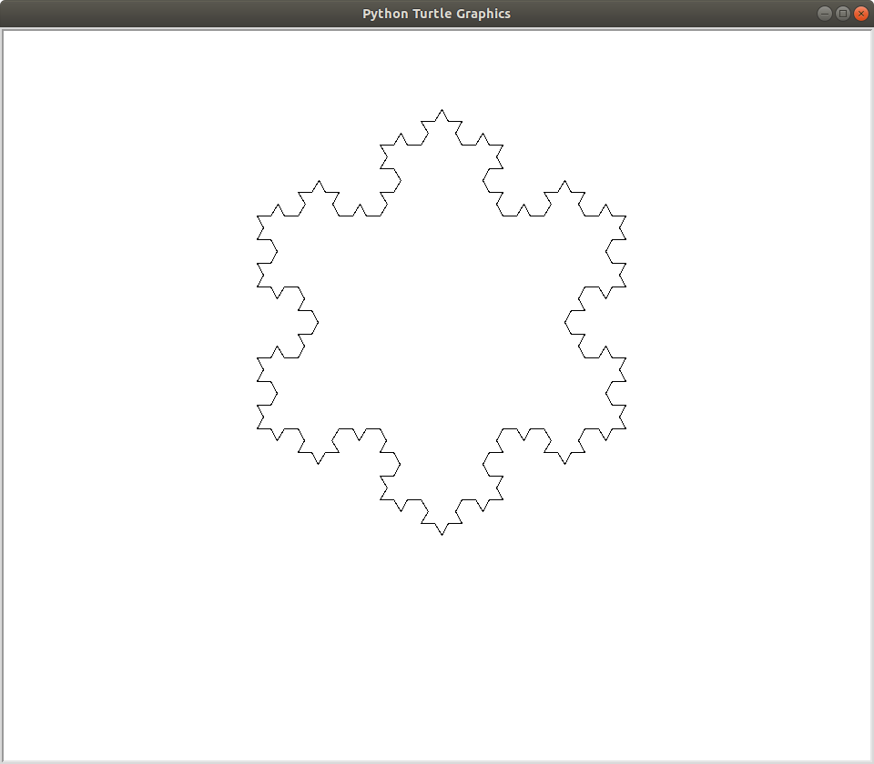

# About

This repository provides a simple way of representing L-Systems using Python3 turtle graphics:

> An L-system or Lindenmayer system is a parallel rewriting system and a type of formal grammar. An L-system consists of an alphabet of symbols that can be used to make strings, a collection of production rules that expand each symbol into some larger string of symbols, an initial "axiom" string from which to begin construction, and a mechanism for translating the generated strings into geometric structures.  
Source: <https://en.wikipedia.org/wiki/L-system>

The program currently consists of a single Python program which reads in a JSON file, rewrites the system and draws the representation using turtle graphics. The JSON file input contains information such as the starting axiom and the production rules.

# Usage

`main.py`: takes one command line argument (a JSON file) and draws a representation based on the file's contents.  
ex. `$ ./main.py json/koch_snowflake.json` or `$ python3 json/koch_snowflake.json` will draw:  

### JSON file parameters:

- **rules**: an array of production rules ex. {"F": "FF", "G": "F[G]G"}
	- if a character in the input string does not match any production rules, it will be replaced with itself
- **axiom**: starting character of rewrite system
- **iterations**: number of times to rewrite before drawing
- **angle**: angle in degrees that turtle turns on '+' or '-' command
- **unit**: distance turtle moves on 'F' or 'G' command
- **heading**: turtle's starting direction; 0-360 with 0 being East
- **x**, **y**: turtle's starting position; (0, 0) being the center of the screen
- **color** (optional): turtle's pen color in hex string format; "#00aaFF"

# Grammar

All of the commands currently supported are as follows:  
- **F**, **G** : move forward one distance unit
- **+**/**-** : turn left/right by one angle unit
- **[** : push the turtle's position and angle
- **]** : pop the turtle's position and angle
- **|**: turn right as close to 180 degrees as the current angle unit will allow

When drawing, any character that does not map to a command will be ignored.  

# Resources

- <https://en.wikipedia.org/wiki/L-system>
- <http://paulbourke.net/fractals/lsys/>
